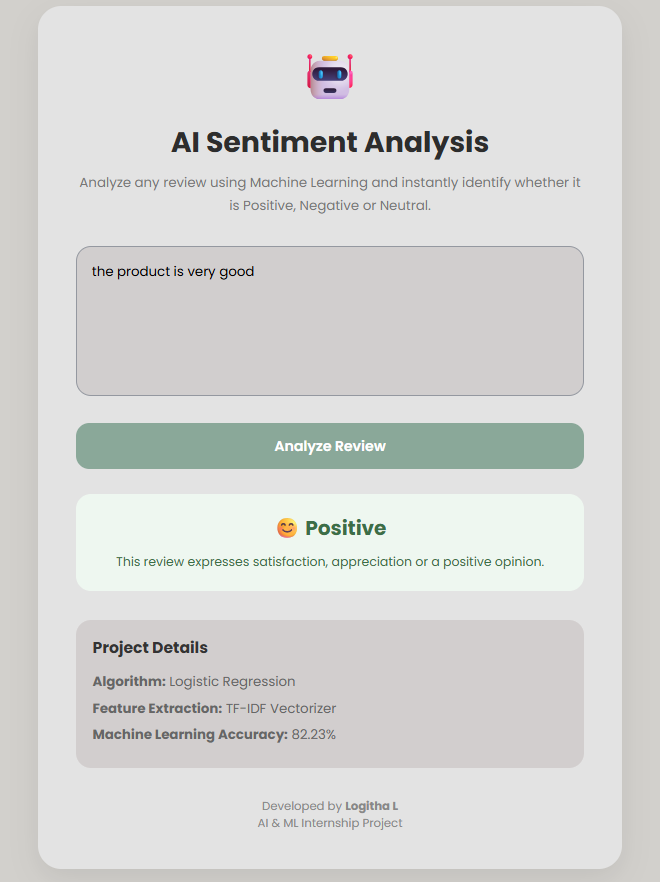
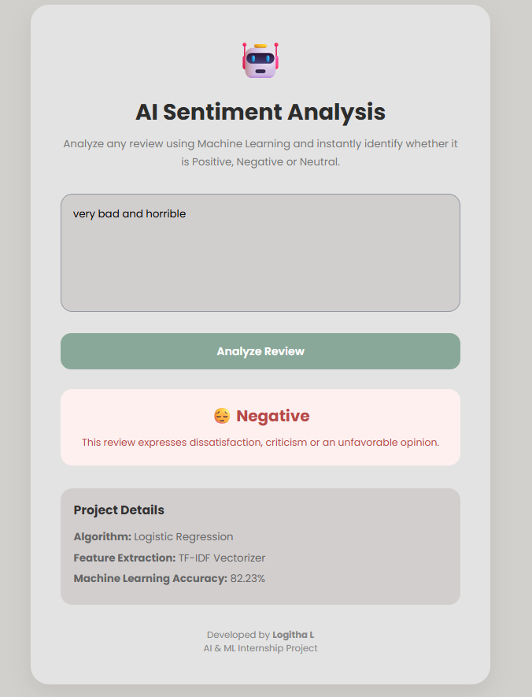

# AI Based Sentiment Analysis System

## Project Description

This project predicts whether a user review is Positive, Negative, or Neutral using Machine Learning.

## Technologies Used

- Python
- Flask
- Pandas
- Scikit-learn
- TF-IDF Vectorizer
- Logistic Regression

## Dataset

Twitter Sentiment Analysis Dataset

## Machine Learning Algorithm

Logistic Regression

## Accuracy

82.23%

## Features

- Enter a review
- Predict sentiment
- Web interface using Flask

## Project Structure

- train_model.py
- app.py
- templates/
- model/
- dataset/

## 📸 Screenshots

### Home Page

### Positive Prediction

### Negative Prediction

### Neutral Prediction

## Author

Logitha L