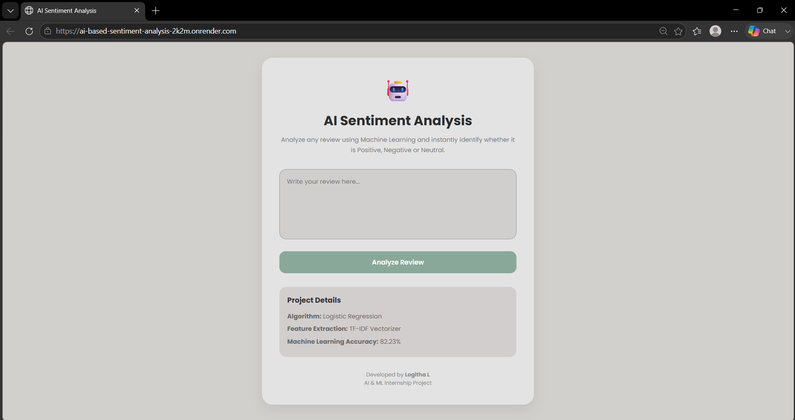
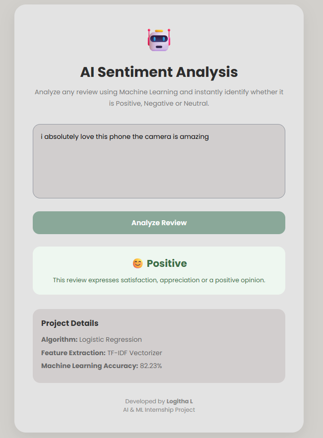
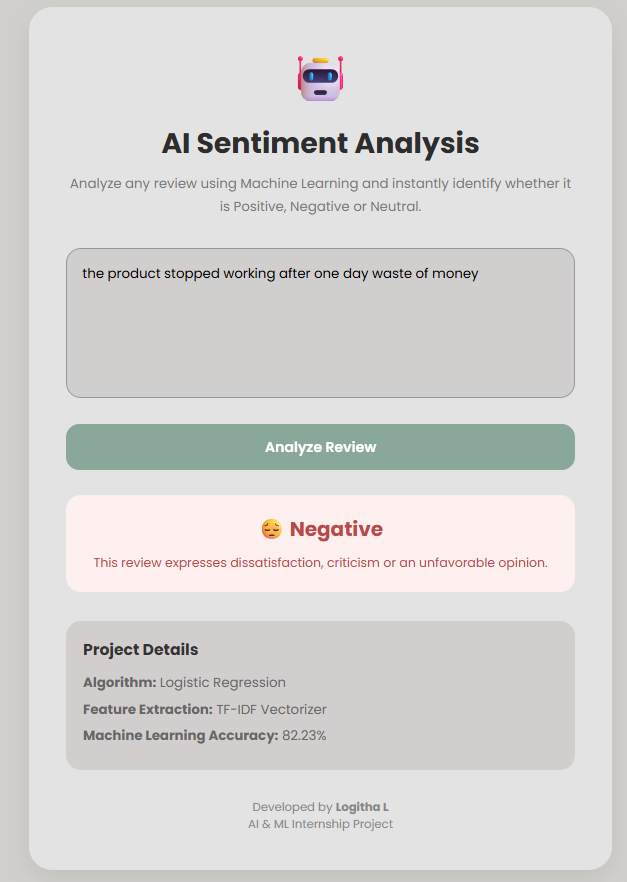
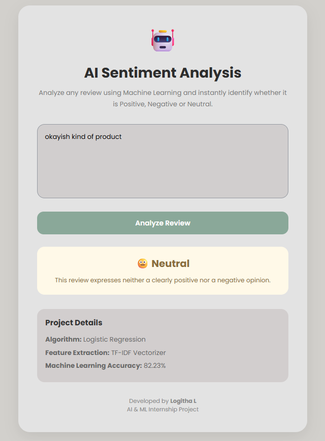

# 🤖 AI-Based Sentiment Analysis System

🌐 **Live Demo:** https://ai-based-sentiment-analysis-2k2m.onrender.com/

💻 **GitHub:** https://github.com/logithalakshmanan/AI-Based-Sentiment-Analysis

---

## 📖 About

An AI-powered web application that predicts whether a review is **Positive**, **Negative**, or **Neutral** using **Machine Learning**.

---

## 🚀 Tech Stack

- Python
- Flask
- HTML & CSS
- Scikit-learn
- TF-IDF Vectorizer
- Logistic Regression
- Render
- Git & GitHub

---

## 📊 Model

- **Dataset:** Twitter Entity Sentiment Analysis
- **Training Samples:** 61,121
- **Algorithm:** Logistic Regression
- **Accuracy:** **82.23%**

---

## 📸 Screenshots

### Home Page


### Positive Prediction


### Negative Prediction


### Neutral Prediction


---

## ▶️ Run Locally

```bash
git clone https://github.com/logithalakshmanan/AI-Based-Sentiment-Analysis.git

cd AI-Based-Sentiment-Analysis

pip install -r requirements.txt

python app.py
```

---

## 👩‍💻 Author

**Logitha L**

⭐ If you like this project, consider giving it a star!